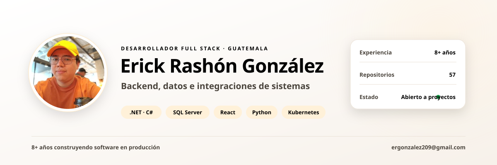

<picture>
  <source media="(prefers-color-scheme: dark)" srcset="assets/banner-dark.svg">
  <source media="(prefers-color-scheme: light)" srcset="assets/banner-light.svg">
  
</picture>

  
  
  

---

## Hola, soy Erick 👋

Desarrollador full stack desde Ciudad de Guatemala. Construyo el lado que no se ve: **APIs, integraciones entre sistemas y la capa de datos** que sostiene el producto.

Más de ocho años sobre **.NET y SQL Server**, con los procedimientos almacenados como contrato entre la base y la aplicación. También trabajo con Python para servicios y automatización, y con React cuando el proyecto necesita su propia interfaz administrativa.

Lo que me interesa no es la tecnología del año, sino que el sistema siga funcionando cuando yo ya no esté en el proyecto: límites claros, datos consistentes y despliegues repetibles.

 

## En qué puedo ayudarte

| | |
|:--|:--|
| 🔗 **Backend e integraciones** | APIs REST, lógica de negocio y servicios que sincronizan datos entre plataformas que no fueron pensadas para hablarse. |
| 🗄️ **Arquitectura de datos** | Modelado relacional, T-SQL y PL/pgSQL, procedimientos almacenados, optimización de consultas y ETL. |
| 🛒 **Comercio electrónico** | Tiendas a medida, pasarelas de pago, catálogos e integración con servicios externos. |
| 💻 **Aplicaciones web** | Paneles administrativos e interfaces en React, con componentes reutilizables y estado predecible. |
| 📱 **Escritorio y móvil** | Herramientas Windows para automatizar procesos internos; aplicaciones Android e iOS. |
| ☁️ **Despliegue** | Contenedores sobre Linux con Podman y Kubernetes, y automatización del ciclo de publicación. |

 

## Stack

**Backend**

**Bases de datos**

**Frontend**

**Infraestructura**

 

## Proyectos destacados

| Proyecto | Descripción | Stack |
|:--|:--|:--|
| **[DigitalForge](https://github.com/yetto-tools/DigitalForge)** | Editor y simulador de lógica digital multiplataforma, con motor de simulación propio para circuitos grandes, biblioteca de unos 40 componentes y extensión mediante definiciones JSON. | `C++` `Qt 6` `CMake` |
| **[bpmn-js Desktop](https://github.com/yetto-tools/bpmn-js-desktop)** | Modelador de procesos BPMN 2.0 llevado al escritorio, sobre el motor de renderizado de bpmn-io. | `JavaScript` `BPMN 2.0` |
| **[SocketIO .NET](https://github.com/yetto-tools/SocketIO)** | Capa ligera de comunicación por TCP, UDP y puerto serie para integrar PLCs, sensores, impresoras y lectores de código de barras, con codecs de tramado propios. | `C#` `TCP · UDP · Serie` |
| **[BareORM](https://github.com/yetto-tools/BareORM)** | ORM para SQL Server con los procedimientos almacenados como ciudadano de primera clase: mapeo, operaciones masivas, migraciones y CLI de esquema. | `.NET 10` `SQL Server` |
| **[SQLClientService](https://github.com/yetto-tools/SQLClientService)** | Servicio de acceso a datos sobre ADO.NET para consumir SQL Server desde aplicaciones .NET. | `C#` `ADO.NET` |
| **[AuthApiCore](https://github.com/yetto-tools/AuthApiCore)** | API de autenticación contenedorizada, lista para desplegar. | `.NET` `Docker` |
| **[Gestión de créditos](https://github.com/yetto-tools/creditos-backend)** | API en .NET para administración de créditos, con su [interfaz administrativa](https://github.com/yetto-tools/creditos-front) en JavaScript. | `.NET` `JavaScript` |
| **[ETL Universidad](https://github.com/yetto-tools/ETL_UNIVERSIDAD)** | Procesos de extracción, transformación y carga para consolidar información académica. | `PL/SQL` |
| **[QEMU Manager](https://github.com/yetto-tools/Qemu-Manager-PyQT)** | Gestor de escritorio para crear y administrar máquinas virtuales QEMU. | `Python` `PyQt` |

 

## Actividad

  
  

 

## ¿Tienes un proyecto en mente?

Cuéntame qué tienes hoy y qué debería hacer mañana. Respondo con un diagnóstico y una ruta de trabajo, sin compromiso.

**[ergonzalez209@gmail.com](mailto:ergonzalez209@gmail.com)** · **[LinkedIn](https://www.linkedin.com/in/erick-orlando-rash%C3%B3n-gonz%C3%A1lez-3343851a2)** · **[Currículum](assets/CV.pdf)**
